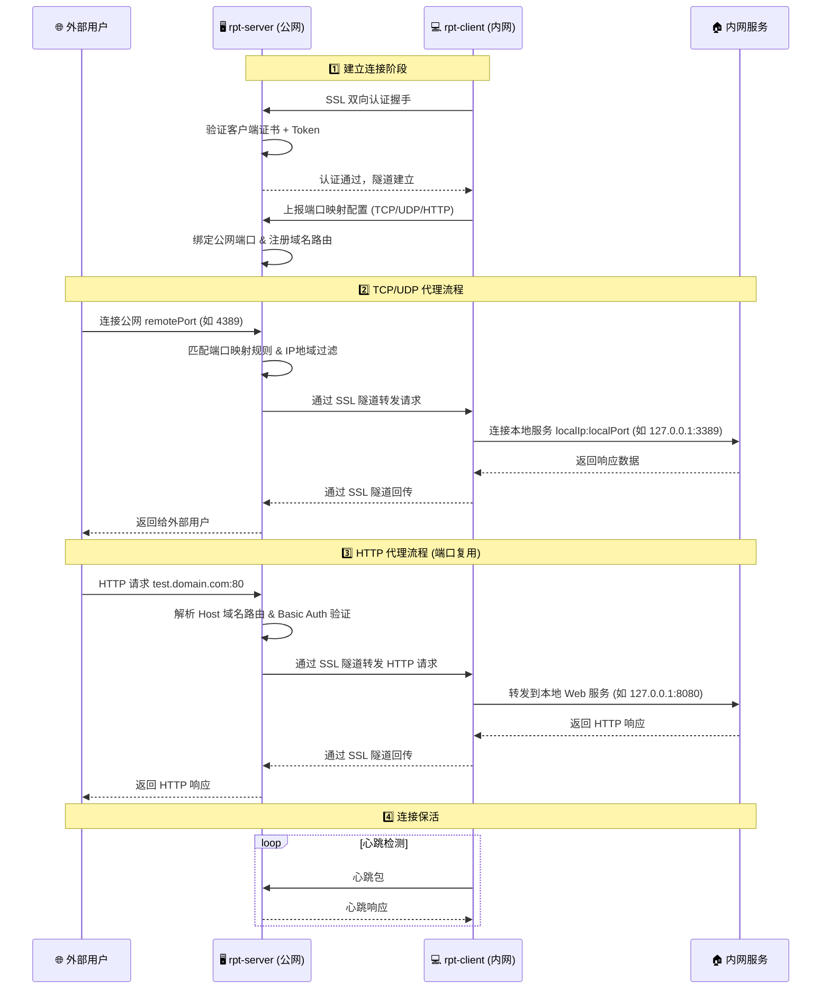
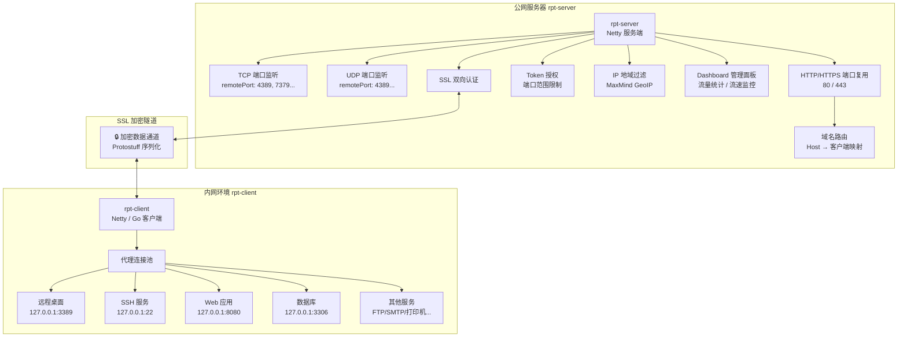
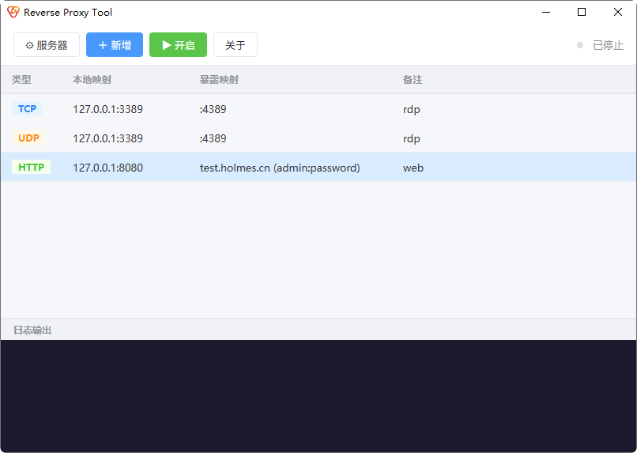
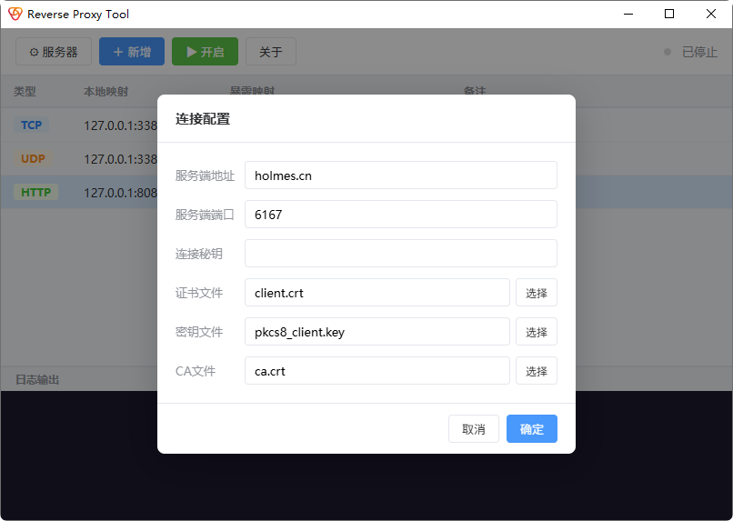
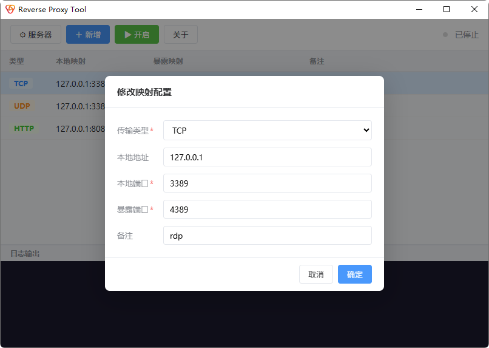
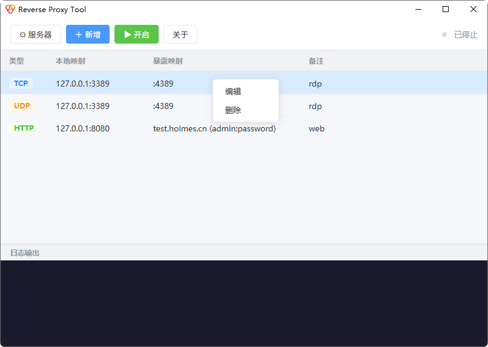
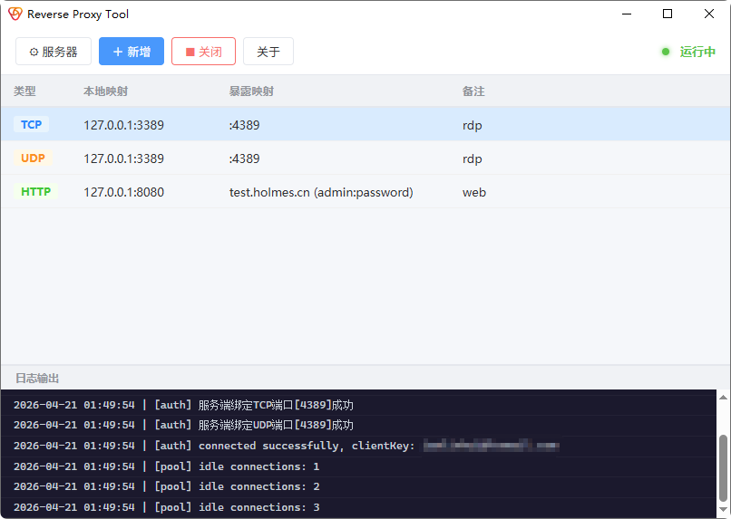

<p align="center">
  
</p>

<h1 align="center">RPT - Reverse Proxy Tool</h1>

<p align="center">
  <strong>一个高性能的内网穿透工具，将局域网个人电脑、服务器代理映射到公网</strong>
</p>

<p align="center">
  
  
  
  
  
</p>

---

## 📖 目录

- [项目简介](#-项目简介)
- [功能特性](#-功能特性)
- [项目架构](#-项目架构)
- [使用场景](#-使用场景)
- [快速开始](#-快速开始)
- [GUI 桌面客户端](#-gui-桌面客户端)
- [配置详解](#-配置详解)
- [部署指南](#-部署指南)
- [Dashboard 管理面板](#-dashboard-管理面板)
- [Go 客户端](#-go-客户端)
- [SSL 证书](#-ssl-证书)
- [常见问题](#-常见问题)
- [Star History](#-star-history)

---

## 🚀 项目简介

**RPT (Reverse Proxy Tool)** 是一款基于 Netty 的内网穿透工具，通过在公网服务器与内网客户端之间建立安全隧道，将内网服务暴露到公网，实现外部访问。

### 工作原理





---

## ✨ 功能特性

| 特性 | 说明 |
|------|------|
| 🔌 **TCP 代理** | 支持任何 TCP 上层协议：RDP远程桌面、SSH、FTP、数据库连接等 |
| 📡 **UDP 代理** | 支持任何 UDP 上层协议：DNS转发、游戏服务器代理等 |
| 🌐 **HTTP 端口复用** | 多个客户端共用服务端 80/443 端口，通过域名区分路由 |
| 🔒 **SSL 双向认证** | 客户端与服务端双向 SSL 验证，数据加密传输 |
| 🌍 **IP 地域过滤** | 基于 MaxMind GeoIP 数据库限制访问来源国家 |
| 🔑 **Token 授权** | 每个客户端独立密钥，可限制端口绑定范围 |
| ⬆️ **协议升级** | HTTP 请求支持升级为 WebSocket、HTTP/2 |
| 📊 **Dashboard** | 内置 Web 管理面板，实时监控在线客户端、流量统计、流速监控 |
| ⚡ **零拷贝传输** | 基于 Netty ByteBuf retainedSlice 全链路零拷贝，堆外内存直接转发 |
| 🔄 **断线自动重连** | 客户端指数退避自动重连 + 心跳保活，网络波动后自动恢复隧道 |
| 🖥️ **桌面客户端** | 提供 GUI 桌面客户端，开箱即用 |
| 🐳 **Docker 部署** | 提供 Docker 镜像，一键启动 |
| 🐹 **Go 客户端** | 轻量级 Go 实现，无需 JVM 环境 |

---

## 🏗️ 项目架构

```
rpt/
├── rpt-base/          # 基础模块 - 公共协议、编解码、工具类
├── rpt-server/        # 服务端 (Java) - 部署在公网服务器
├── rpt-client/        # 客户端 (Java) - 部署在内网机器
├── rpt-client-go/     # 客户端 (Go) - 轻量级Go实现
├── rpt-desktop/       # 桌面客户端 (JavaFX)
├── rpt-desktop-go/    # 桌面客户端 (Wails + Go)
└── doc/               # 文档资源
```

### 技术栈

| 组件 | 技术 |
|------|------|
| 服务端 | Java 8+, Netty 4.1, Protostuff |
| Java 客户端 | Java 8+, Netty 4.1 |
| Go 客户端 | Go 1.20+ |
| 桌面客户端 | Wails (Go + Web前端) |
| 序列化 | Protostuff |
| 配置文件 | YAML (SnakeYAML / Jackson) |
| 日志 | Logback |
| IP 地域库 | MaxMind GeoIP2 |
| 构建工具 | Maven / Go Modules |

---

## 🎯 使用场景

- **远程桌面** — 在外网通过 RDP 远程连接公司/家中电脑
- **Web 开发调试** — 本地支付接口回调调试、微信公众号/小程序本地调试
- **SSH 远程访问** — 远程连接内网 Linux 服务器
- **数据库连接** — 远程连接内网 MySQL、Redis 等数据库
- **HTTP 反向代理** — 共享 80/443 端口为多个内网 Web 服务提供公网访问
- **DNS 转发** — UDP 代理实现 DNS 请求转发
- **游戏联机** — 代理游戏服务器实现公网联机
- **打印机共享** — 远程连接内网打印机

---

## ⚡ 快速开始

### 前置条件

| 组件 | 要求 |
|------|------|
| 公网服务器 | 一台具有公网 IP 的服务器 |
| Java 客户端 | JDK/JRE 8+ |
| Go 客户端 | 无需额外运行环境 (独立二进制) |
| 服务端 | JDK/JRE 8+ |

### 第一步：编译构建

```bash
# 克隆项目
git clone https://github.com/iamlinhui/rpt.git
cd rpt

# 构建 Java 服务端和客户端
mvn clean package -Dmaven.test.skip=true

# 构建 Go 客户端 (可选)
cd rpt-client-go
go build -o rpt-client-go
```

### 第二步：部署服务端

将 `rpt-server/target/rpt-server-*.jar` 和 `server.yml` 上传到公网服务器：

```bash
java -jar rpt-server-2.6.1.jar -c server.yml
```

### 第三步：启动客户端

**Java 客户端：**

```bash
java -jar rpt-client-2.6.1.jar -c client.yml
```

**Go 客户端：**

```bash
./rpt-client-go -config client.yml -cert client.crt -key pkcs8_client.key -ca ca.crt
```

### 第四步：验证连接

客户端启动后会自动连接服务端并注册端口映射。例如配置了 `localPort: 3389 → remotePort: 4389`，则可以通过 `公网IP:4389` 访问内网的 3389 端口服务。

---

## 🖥️ GUI 桌面客户端

提供基于 Wails 的图形界面客户端，无需手动编辑配置文件。

| 界面 | 截图 |
|------|------|
| 主界面 |  |
| 系统配置 |  |
| TCP 映射配置 |  |
| HTTP 映射配置 |  |
| 删除映射配置 |  |
| 控制台输出 |  |

### 编译桌面客户端

```bash
cd rpt-desktop-go
wails build
```

编译后的可执行文件在 `build/bin/` 目录下。

---

## 📝 配置详解

### 服务端配置 `server.yml`

```yaml
# 服务端绑定IP (0.0.0.0表示监听所有网卡)
serverIp: 0.0.0.0

# 服务端与客户端通讯端口
serverPort: 6167

# HTTP重定向端口 (为0则不开启，默认0)
httpPort: 80

# HTTPS复用端口 (为0则不开启，默认0)
httpsPort: 443

# 域名证书公钥 (httpsPort为0时不生效)
domainCert: domain.crt

# 域名证书私钥 (httpsPort为0时不生效)
domainKey: pkcs8_domain.key

# 是否限制连接暴露端口的IP必须在当前地区国家 (默认false)
ipFilter: true

# Dashboard管理面板端口 (为0则不开启，默认0)
dashboardPort: 8000

# Dashboard登录账号
dashboardUser: admin

# Dashboard登录密码
dashboardPassword: admin

# 客户端授权Token列表
token:
  - clientKey: b0cc39c7-1b78-4ff6-9486-020399f569e9
    minPort: 4000    # 允许绑定的最小端口 (默认1024)
    maxPort: 8000    # 允许绑定的最大端口 (默认65535)
  - clientKey: 4befea7e-a61c-4979-b012-47659bab6f21
    minPort: 9000
    maxPort: 9999
```

#### 服务端配置参数说明

| 参数 | 类型 | 默认值 | 说明 |
|------|------|--------|------|
| `serverIp` | String | `0.0.0.0` | 服务端绑定的IP地址 |
| `serverPort` | int | `6167` | 服务端与客户端通讯端口 |
| `httpPort` | int | `0` | HTTP重定向端口，为0不开启 |
| `httpsPort` | int | `0` | HTTPS复用端口，为0不开启 |
| `domainCert` | String | `server.crt` | 域名证书公钥路径 |
| `domainKey` | String | `pkcs8_server.key` | 域名证书私钥路径 |
| `ipFilter` | boolean | `false` | 是否启用IP地域过滤 |
| `dashboardPort` | int | `0` | Dashboard管理面板端口，为0不开启 |
| `dashboardUser` | String | - | Dashboard登录账号 |
| `dashboardPassword` | String | - | Dashboard登录密码 |
| `token[].clientKey` | String | - | 客户端授权密钥 (UUID) |
| `token[].minPort` | int | `1024` | 允许绑定的最小端口号 |
| `token[].maxPort` | int | `65535` | 允许绑定的最大端口号 |

### 客户端配置 `client.yml`

```yaml
# 服务端IP (公网服务器IP或域名)
serverIp: 123.45.67.89

# 服务端通讯端口 (与server.yml的serverPort一致)
serverPort: 6167

# 授权密钥 (与server.yml中token列表对应)
clientKey: b0cc39c7-1b78-4ff6-9486-020399f569e9

# 端口映射配置列表
config:
  # TCP代理示例：远程桌面
  - proxyType: TCP
    localIp: 127.0.0.1
    localPort: 3389
    remotePort: 4389
    description: rdp-tcp

  # UDP代理示例：远程桌面UDP
  - proxyType: UDP
    localIp: 127.0.0.1
    localPort: 3389
    remotePort: 4389
    description: rdp-udp

  # TCP代理示例：Redis
  - proxyType: TCP
    localIp: 127.0.0.1
    localPort: 6379
    remotePort: 7379
    description: redis

  # HTTP代理示例：Web应用
  - proxyType: HTTP
    localIp: 127.0.0.1
    localPort: 8080
    domain: test.domain.com       # 访问域名
    token: admin:admin            # Basic认证 (可选)
    description: tomcat
```

#### 客户端配置参数说明

| 参数 | 类型 | 说明 |
|------|------|------|
| `serverIp` | String | 服务端公网IP或域名 |
| `serverPort` | int | 服务端通讯端口 |
| `clientKey` | String | 客户端授权密钥 |
| `config[].proxyType` | String | 代理类型：`TCP` / `UDP` / `HTTP` |
| `config[].localIp` | String | 内网目标服务IP |
| `config[].localPort` | int | 内网目标服务端口 |
| `config[].remotePort` | int | 服务端暴露端口 (TCP/UDP模式) |
| `config[].domain` | String | 访问域名 (HTTP模式，支持 `*.domain.com` 通配符) |
| `config[].token` | String | HTTP Basic 认证 `用户名:密码` (可选) |
| `config[].description` | String | 映射描述信息 |

### 三种代理类型对比

| 类型 | 协议 | 端口 | 域名 | 适用场景 |
|------|------|------|------|----------|
| **TCP** | TCP | 需要指定 `remotePort` | 不需要 | RDP、SSH、数据库、FTP 等 |
| **UDP** | UDP | 需要指定 `remotePort` | 不需要 | DNS转发、游戏服务器 等 |
| **HTTP** | HTTP/HTTPS | 复用服务端 80/443 端口 | 需要配置 `domain` | Web应用、API接口 等 |

---

## 📦 部署指南

### 方式一：直接运行 (推荐快速体验)

```bash
# 服务端
java -jar rpt-server-2.6.1.jar -c server.yml

# 客户端
java -jar rpt-client-2.6.1.jar -c client.yml
```

### 方式二：生产环境部署 (Java)

> 在 jar 包的当前目录下，新建 `conf` 文件夹，将配置文件和证书放入其中。

#### 目录结构

```
/opt/rpt-server/
├── rpt-server-2.6.1.jar
├── conf/
│   ├── server.yml
│   ├── ca.crt
│   ├── server.crt
│   ├── pkcs8_server.key
│   ├── domain.crt          # HTTPS域名证书 (可选)
│   ├── pkcs8_domain.key    # HTTPS域名私钥 (可选)
│   └── Country.mmdb        # GeoIP数据库 (可选)
└── logs/

/opt/rpt-client/
├── rpt-client-2.6.1.jar
├── conf/
│   ├── client.yml
│   ├── ca.crt
│   ├── client.crt
│   └── pkcs8_client.key
└── logs/
```

#### 启动脚本 `start.sh`

```bash
java -server -d64 -XX:+UseG1GC -XX:MaxGCPauseMillis=200 -Dnetworkaddress.cache.ttl=600 \
     -Djava.security.egd=file:/dev/./urandom -Djava.awt.headless=true -Duser.timezone=Asia/Shanghai -Duser.country=CN \
     -Dclient.encoding.override=UTF-8 -Dfile.encoding=UTF-8 -Xbootclasspath/a:./conf \
     -jar rpt*.jar > /dev/null 2>&1 & echo $! > pid.file &
```

#### 停止脚本 `stop.sh`

```bash
kill $(cat pid.file)
```

### 方式三：Docker 部署

```bash
# 1. 构建镜像
cd rpt-client
mvn clean package -Dmaven.test.skip=true
docker build -f Dockerfile -t rpt-client .

# 2. 准备配置文件目录
mkdir -p /opt/rpt/conf
# 将 client.yml、ca.crt、client.crt、pkcs8_client.key 放入 /opt/rpt/conf/

# 3. 启动容器
docker run -d \
  -v /opt/rpt/conf:/home/rpt/conf \
  --restart=always \
  --name rpt-client \
  rpt-client
```

Docker Hub 镜像地址: https://hub.docker.com/r/promptness/rpt-client

### 方式四：注册 Linux 系统服务

#### Go 客户端 systemd 服务

创建 `/etc/systemd/system/rpt-client-go.service`：

```ini
[Unit]
Description=RPT Client Go
After=network.target

[Service]
Type=simple
WorkingDirectory=/opt/rpt
ExecStart=/opt/rpt/rpt-client-go -config client.yml -cert client.crt -key pkcs8_client.key -ca ca.crt
Restart=always
RestartSec=5

[Install]
WantedBy=multi-user.target
```

```bash
sudo systemctl daemon-reload
sudo systemctl enable rpt-client-go
sudo systemctl start rpt-client-go
sudo systemctl status rpt-client-go
```

#### Java 客户端 systemd 服务

创建 `/etc/systemd/system/rpt-client.service`：

```ini
[Unit]
Description=RPT Client Java
After=network.target

[Service]
Type=simple
WorkingDirectory=/opt/rpt-client
ExecStart=/usr/bin/java -server -XX:+UseG1GC -XX:MaxGCPauseMillis=200 -Dnetworkaddress.cache.ttl=600 -Djava.security.egd=file:/dev/./urandom -Djava.awt.headless=true -Duser.timezone=Asia/Shanghai -Dclient.encoding.override=UTF-8 -Dfile.encoding=UTF-8 -Xbootclasspath/a:./conf -jar rpt-client-2.6.1.jar
Restart=always
RestartSec=5

[Install]
WantedBy=multi-user.target
```

### 方式五：注册 Windows 服务

1. 下载 [WinSW](https://github.com/winsw/winsw/releases)，将 `WinSW-x64.exe` 重命名为 `rpt-client.exe`
2. 与 `rpt-client.jar` 放在同一目录
3. 创建 `rpt-client.xml`：

```xml
<service>
    <id>rpt-client</id>
    <name>rpt-client</name>
    <description>RPT Client - Reverse Proxy Tool</description>
    <executable>java</executable>
    <arguments>-server -d64 -XX:+UseG1GC -XX:MaxGCPauseMillis=200 -Dnetworkaddress.cache.ttl=600 -Djava.security.egd=file:/dev/./urandom -Djava.awt.headless=true -Duser.timezone=Asia/Shanghai -Duser.country=CN -Dclient.encoding.override=UTF-8 -Dfile.encoding=UTF-8 -Xbootclasspath/a:./conf -jar rpt-client.jar</arguments>
</service>
```

4. 执行注册：

```cmd
rpt-client.exe install
rpt-client.exe start
```

---

## 📊 Dashboard 管理面板

服务端内置 Web Dashboard，提供实时监控和管理功能。

### 开启方式

在 `server.yml` 中配置 `dashboardPort` 为非零端口即可：

```yaml
dashboardPort: 8000
dashboardUser: admin
dashboardPassword: admin
```

启动服务端后访问 `http://服务器IP:8000`，输入账号密码即可进入。

### 功能

| 功能 | 说明 |
|------|------|
| **服务状态** | 运行时间、在线客户端数、历史连接数 |
| **客户端列表** | 查看所有在线客户端的 ClientKey、远程地址、连接时间、代理端口 |
| **流量统计** | 每个客户端的入站/出站总流量 |
| **实时流速** | 基于 5 秒滑动窗口的入站/出站实时流速 |
| **域名绑定** | 查看 HTTP 代理的域名路由和在线状态 |
| **踢出客户端** | 一键断开指定客户端连接 |
| **自动刷新** | 页面每 5 秒自动刷新数据 |
| **响应式布局** | 支持 PC 和移动端访问 |

### REST API

| 方法 | 路径 | 说明 |
|------|------|------|
| GET | `/api/status` | 服务状态 |
| GET | `/api/clients` | 在线客户端列表 |
| DELETE | `/api/clients/{id}` | 踢出指定客户端 |
| GET | `/api/domains` | HTTP 域名绑定列表 |

---

## 🐹 Go 客户端

使用 Go 语言实现的轻量级客户端，功能与 Java 客户端一致，适合不便安装 JVM 的环境。

### 命令行参数

| 参数 | 默认值 | 说明 |
|------|--------|------|
| `-config` | `client.yml` | 客户端配置文件路径 |
| `-cert` | `client.crt` | 客户端证书路径 |
| `-key` | `pkcs8_client.key` | 客户端私钥路径 |
| `-ca` | `ca.crt` | CA证书路径 |

### 编译

```bash
cd rpt-client-go
go build -o rpt-client-go
```

### 交叉编译

```bash
# Linux amd64
GOOS=linux GOARCH=amd64 go build -o rpt-client-go

# Linux arm64 (树莓派等)
GOOS=linux GOARCH=arm64 go build -o rpt-client-go

# Windows
GOOS=windows GOARCH=amd64 go build -o rpt-client-go.exe

# macOS (Intel)
GOOS=darwin GOARCH=amd64 go build -o rpt-client-go

# macOS (Apple Silicon)
GOOS=darwin GOARCH=arm64 go build -o rpt-client-go
```

---

## 🔐 SSL 证书

RPT 使用 SSL 双向认证确保通讯安全。项目自带测试用证书，**生产环境请务必替换**。

### 证书生成流程

> 自建CA → 生成服务端/客户端私钥 → 生成CSR → 签发x509证书 → PKCS#8编码

#### 1. 安装 OpenSSL

- Linux: `apt install openssl` 或 `yum install openssl`
- Windows: 下载 [Win32OpenSSL](http://slproweb.com/products/Win32OpenSSL.html)
- macOS: `brew install openssl`

#### 2. 建立 CA

```bash
openssl req -new -x509 -keyout ca.key -out ca.crt -days 36500
```

#### 3. 生成私钥

```bash
# 服务端
openssl genrsa -des3 -out server.key 1024

# 客户端
openssl genrsa -des3 -out client.key 1024
```

#### 4. 生成 CSR

```bash
# 服务端
openssl req -new -key server.key -out server.csr

# 客户端
openssl req -new -key client.key -out client.csr
```

> ⚠️ 如果生成 `server.csr` 后再生成 `client.csr` 提示错误，请关闭当前终端重新打开执行。

#### 5. 签发证书

```bash
# 服务端
openssl x509 -req -days 3650 -in server.csr -CA ca.crt -CAkey ca.key -CAcreateserial -out server.crt

# 客户端
openssl x509 -req -days 3650 -in client.csr -CA ca.crt -CAkey ca.key -CAcreateserial -out client.crt
```

#### 6. PKCS#8 编码

```bash
# 服务端
openssl pkcs8 -topk8 -in server.key -out pkcs8_server.key -nocrypt

# 客户端
openssl pkcs8 -topk8 -in client.key -out pkcs8_client.key -nocrypt
```

### 证书分发

| 端 | 所需文件 |
|----|----------|
| **Server** | `ca.crt`、`server.crt`、`pkcs8_server.key` |
| **Client** | `ca.crt`、`client.crt`、`pkcs8_client.key` |

> ⚠️ Server 和 Client 使用同一个 `ca.crt`，即由同一 CA 签发。

---

## 🔄 更新 IP 地域库

服务端支持基于 MaxMind GeoIP 数据库的 IP 地域过滤功能。

下载地址：
- [MaxMind GeoLite2](https://dev.maxmind.com/geoip/geolite2-free-geolocation-data)
- [Loyalsoldier/geoip](https://github.com/Loyalsoldier/geoip/releases)
- [Dreamacro/maxmind-geoip](https://github.com/Dreamacro/maxmind-geoip/releases)

将下载的 `Country.mmdb` 放入服务端的 `conf` 文件夹中。

---

## ❓ 常见问题

<details>
<summary><b>Q: 客户端连接不上服务端？</b></summary>

1. 检查服务端防火墙是否开放 `serverPort` 端口（默认 6167）
2. 检查 `client.yml` 中 `serverIp` 和 `serverPort` 是否正确
3. 检查 `clientKey` 是否与服务端 `token` 列表匹配
4. 检查 SSL 证书是否由同一 CA 签发
</details>

<details>
<summary><b>Q: TCP 端口映射后无法访问？</b></summary>

1. 检查服务端防火墙是否开放 `remotePort` 对应端口
2. 检查 `remotePort` 是否在服务端 token 配置的 `minPort` ~ `maxPort` 范围内
3. 检查内网目标服务是否正常运行
4. 如果启用了 `ipFilter`，确认访问者 IP 所在国家是否匹配
</details>

<details>
<summary><b>Q: HTTP 代理如何配置域名？</b></summary>

1. 将域名 DNS 解析到公网服务器 IP（A 记录）
2. 支持通配符域名 `*.domain.com`，例如 `test.domain.com`
3. 客户端 `client.yml` 中 `domain` 字段填写完整域名
4. 服务端需开启 `httpPort` 或 `httpsPort`
</details>

<details>
<summary><b>Q: JavaFX 桌面客户端界面变黑？</b></summary>

JavaFX 硬件渲染在屏幕分辨率变化时可能出现控件变黑问题，添加 JVM 参数启用软件渲染：

```bash
-Dprism.order=sw
```
</details>

<details>
<summary><b>Q: 如何使用 HTTPS？</b></summary>

1. 申请域名 SSL 证书（如 Let's Encrypt）
2. 将证书公钥和私钥（PKCS#8 格式）放入服务端 `conf` 目录
3. 在 `server.yml` 中配置 `httpsPort`、`domainCert`、`domainKey`
</details>

---

## 📋 支持的 TCP 上层协议

| 协议 | 用途 |
|------|------|
| HTTP/HTTPS | Web 浏览 |
| FTP | 文件传输 |
| SSH | 安全远程登录 |
| RDP | 远程桌面 |
| SMTP/POP3 | 邮件收发 |
| Telnet | 远程登录 |
| SOCKS | 代理协议 |

---

## 📋 TODO

- [x] Dashboard 管理面板（流量统计、流速监控、客户端管理）
- [ ] 集群运维版本

---

## ⭐ Star History

[](https://star-history.com/#iamlinhui/rpt&Date)

---

## 📄 License

[MIT License](LICENSE)
