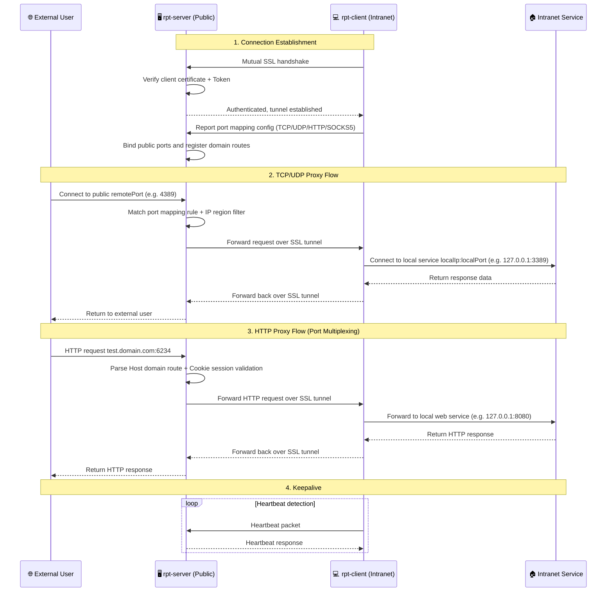
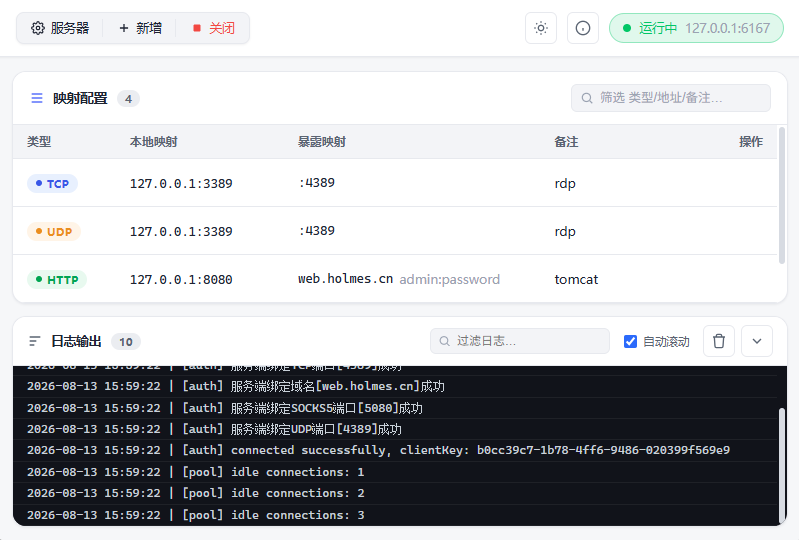
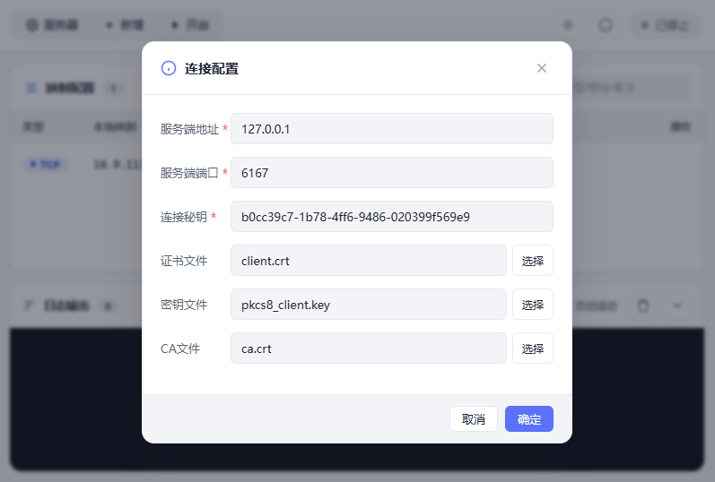

<p align="center">
  
</p>

<h1 align="center">RPT - Reverse Proxy Tool</h1>

<p align="center">
  <a href="README.md">中文</a> | <a href="README_EN.md">English</a>
</p>

<p align="center">
  <strong>A high-performance intranet penetration / reverse proxy / forward proxy tool supporting TCP/UDP upper-layer protocols, HTTP domain multiplexing, and SOCKS5 dynamic proxy</strong>
</p>

<p align="center">
  
  
  
  
  
</p>

---

## 📖 Table of Contents

- [Introduction](#-introduction)
- [Features](#-features)
- [Architecture](#-architecture)
- [Use Cases](#-use-cases)
- [Quick Start](#-quick-start)
- [GUI Desktop Client](#-gui-desktop-client)
- [Configuration](#-configuration)
- [Deployment](#-deployment)
- [Dashboard](#-dashboard)
- [Go Client](#-go-client)
- [SSL Certificates](#-ssl-certificates)
- [FAQ](#-faq)
- [Star History](#-star-history)

---

## 🚀 Introduction

**RPT (Reverse Proxy Tool)** is an intranet penetration / reverse proxy / forward proxy tool. The server is built on Netty and provides both Java and Go clients. It establishes a secure tunnel between a public server and an intranet client through mutual SSL authentication, exposing intranet services to the public network. It supports TCP/UDP upper-layer protocols, HTTP domain multiplexing, and SOCKS5 dynamic proxy, with a built-in Dashboard monitoring panel.

### How It Works



---

## ✨ Features

| Feature | Description |
|---------|-------------|
| 🔌 **TCP Proxy** | Supports any TCP upper-layer protocol: RDP remote desktop, SSH, FTP, database connections, etc. |
| 📡 **UDP Proxy** | Supports any UDP upper-layer protocol: DNS forwarding, game server proxy, etc. |
| 🌐 **HTTP Port Multiplexing** | Multiple clients share the server's HTTP port, routing by domain |
| 🧦 **SOCKS5 Dynamic Proxy** | Standard SOCKS5 protocol proxy; target address is dynamically specified by the client per connection, with optional username/password auth |
| 🔒 **Mutual SSL Authentication** | Two-way SSL verification between client and server, encrypted data transmission |
| 🌍 **IP Region Filtering** | Restrict access source countries based on MaxMind GeoIP database |
| 🔑 **Token Authorization** | Each client has an independent key; port binding range can be restricted |
| ⬆️ **Protocol Upgrade** | HTTP requests support upgrade to WebSocket, HTTP/2 |
| 📊 **Dashboard** | Built-in web management panel for real-time monitoring of online clients, traffic stats, and throughput |
| ⚡ **Zero-Copy Transmission** | Full-link zero-copy based on Netty ByteBuf retainedSlice, direct off-heap memory forwarding |
| 🔄 **Auto Reconnect** | Client exponential backoff auto-reconnect + heartbeat keepalive; tunnel auto-recovers after network fluctuation |
| 🖥️ **Desktop Client** | GUI desktop client, out of the box |
| 🐳 **Docker Deployment** | Docker images provided, one-click start |
| 🐹 **Go Client** | Lightweight Go implementation, no JVM required |

---

## 🏗️ Architecture

```
rpt/
├── rpt-base/          # Base module - common protocol, codec, utilities
├── rpt-server/        # Server (Java) - deployed on public server
├── rpt-client/        # Client (Java) - deployed on intranet machine
├── rpt-client-go/     # Client (Go) - lightweight Go implementation
├── rpt-desktop-go/    # Desktop client (Wails + Go)
└── doc/               # Documentation resources
```

### Tech Stack

| Component | Technology |
|-----------|------------|
| Server | Java 8+, Netty 4.1, Protostuff |
| Java Client | Java 8+, Netty 4.1 |
| Go Client | Go 1.20+ |
| Desktop Client | Wails (Go + Web frontend) |
| Serialization | Protostuff |
| Config Files | YAML (SnakeYAML / Jackson) |
| Logging | Logback |
| IP Region DB | MaxMind GeoIP2 |
| Build Tools | Maven / Go Modules |

---

## 🎯 Use Cases

- **Remote Desktop** — Connect to company/home computers via RDP from outside
- **Web Development Debugging** — Local payment callback debugging, WeChat official account/mini-program local debugging
- **SSH Remote Access** — Remotely connect to intranet Linux servers
- **Database Connection** — Remotely connect to intranet MySQL, Redis, etc.
- **HTTP Reverse Proxy** — Share an HTTP port to provide public access for multiple intranet web services
- **SOCKS5 Network Proxy** — Build a SOCKS5 proxy server for flexible network proxy forwarding, with username/password auth
- **DNS Forwarding** — UDP proxy for DNS request forwarding
- **Online Gaming** — Proxy game servers for public network multiplayer
- **Printer Sharing** — Remotely connect to intranet printers

---

## ⚡ Quick Start

### Prerequisites

| Component | Requirement |
|-----------|-------------|
| Public Server | A server with a public IP |
| Java Client | JDK/JRE 8+ |
| Go Client | No extra runtime required (standalone binary) |
| Server | JDK/JRE 8+ |

### Step 1: Build

```bash
# Clone the project
git clone https://github.com/iamlinhui/rpt.git
cd rpt

# Build Java server and client
mvn clean package -Dmaven.test.skip=true

# Build Go client (optional)
cd rpt-client-go
go build -o rpt-client-go
```

### Step 2: Deploy the Server

Upload `rpt-server/target/rpt-server-*.jar` and `server.yml` to your public server:

```bash
java -jar rpt-server-*.jar -c server.yml
```

### Step 3: Start the Client

**Java client:**

```bash
java -jar rpt-client-*.jar -c client.yml
```

**Go client:**

```bash
./rpt-client-go -c client.yml
```

### Step 4: Verify the Connection

After startup, the client automatically connects to the server and registers port mappings. For example, if you configured `localPort: 3389 → remotePort: 4389`, you can access the intranet's port 3389 service via `PublicIP:4389`.

---

## 🖥️ GUI Desktop Client

A graphical client based on Wails is provided — no need to edit config files manually.

| View | Screenshot |
|------|------------|
| Main |  |
| Settings |  |

### Build the Desktop Client

```bash
cd rpt-desktop-go
wails build
```

The compiled executable is in the `build/bin/` directory.

---

## 📝 Configuration

### Server Config `server.yml`

```yaml
# Server bind IP (0.0.0.0 means listen on all interfaces)
serverIp: 0.0.0.0

# Server-client communication port
serverPort: 6167

# Server CA certificate path (default ca.crt)
serverCaPath: ca.crt

# Server certificate path (default server.crt)
serverCertPath: server.crt

# Server private key path (default pkcs8_server.key)
serverKeyPath: pkcs8_server.key

# HTTP redirect port (0 disables, default 0)
httpPort: 6234

# Restrict exposed-port IPs to these countries (ISO codes, comma-separated, e.g. CN,HK). Empty = country filter disabled (allow all)
ipFilterCountry: CN,HK

# Dashboard management panel port (0 disables, default 0)
dashboardPort: 7476

# Dashboard login username
dashboardUser: admin

# Dashboard login password
dashboardPassword: admin

# Client authorization token list
token:
  - clientKey: b0cc39c7-1b78-4ff6-9486-020399f569e9
    minPort: 4000    # Minimum allowed port (default 1024)
    maxPort: 8000    # Maximum allowed port (default 65535)
  - clientKey: 4befea7e-a61c-4979-b012-47659bab6f21
    minPort: 9000
    maxPort: 9999
```

#### Server Config Parameters

| Parameter | Type | Default | Description |
|-----------|------|---------|-------------|
| `serverIp` | String | `0.0.0.0` | Server bind IP address |
| `serverPort` | int | `6167` | Server-client communication port |
| `serverCaPath` | String | `ca.crt` | Server CA certificate path |
| `serverCertPath` | String | `server.crt` | Server certificate path |
| `serverKeyPath` | String | `pkcs8_server.key` | Server private key path |
| `httpPort` | int | `0` | HTTP redirect port; 0 disables it |
| `ipFilterCountry` | String | empty | Allowed country ISO codes (comma-separated, e.g. `CN,HK`); empty = filter disabled |
| `dashboardPort` | int | `0` | Dashboard management panel port; 0 disables it |
| `dashboardUser` | String | - | Dashboard login username |
| `dashboardPassword` | String | - | Dashboard login password |
| `token[].clientKey` | String | - | Client authorization key (UUID) |
| `token[].minPort` | int | `1024` | Minimum allowed port |
| `token[].maxPort` | int | `65535` | Maximum allowed port |

### Client Config `client.yml`

```yaml
# Server IP (public server IP or domain)
serverIp: 123.45.67.89

# Server communication port (matches serverPort in server.yml)
serverPort: 6167

# Client CA certificate path (default ca.crt)
clientCaPath: ca.crt

# Client certificate path (default client.crt)
clientCertPath: client.crt

# Client private key path (default pkcs8_client.key)
clientKeyPath: pkcs8_client.key

# Authorization key (must match a token entry in server.yml)
clientKey: b0cc39c7-1b78-4ff6-9486-020399f569e9

# Port mapping config list
config:
  # TCP proxy example: remote desktop
  - proxyType: TCP
    localIp: 127.0.0.1
    localPort: 3389
    remotePort: 4389
    description: rdp-tcp

  # UDP proxy example: remote desktop UDP
  - proxyType: UDP
    localIp: 127.0.0.1
    localPort: 3389
    remotePort: 4389
    description: rdp-udp

  # TCP proxy example: Redis
  - proxyType: TCP
    localIp: 127.0.0.1
    localPort: 6379
    remotePort: 7379
    description: redis

  # HTTP proxy example: web app
  - proxyType: HTTP
    localIp: 127.0.0.1
    localPort: 8080
    domain: test.domain.com       # Access domain
    token: admin:admin            # Login credentials (optional, format user:pass)
    description: tomcat

  # SOCKS5 proxy example: dynamic target proxy
  - proxyType: SOCKS5
    remotePort: 5080              # SOCKS5 listening port
    token: admin:admin            # SOCKS5 auth (optional, format user:pass)
    description: socks5
```

#### Client Config Parameters

| Parameter | Type | Description |
|-----------|------|-------------|
| `serverIp` | String | Server public IP or domain |
| `serverPort` | int | Server communication port |
| `clientCaPath` | String | Client CA certificate path (default `ca.crt`) |
| `clientCertPath` | String | Client certificate path (default `client.crt`) |
| `clientKeyPath` | String | Client private key path (default `pkcs8_client.key`) |
| `clientKey` | String | Client authorization key |
| `config[].proxyType` | String | Proxy type: `TCP` / `UDP` / `HTTP` / `SOCKS5` |
| `config[].localIp` | String | Intranet target service IP (SOCKS5 is dynamically specified by client, not needed) |
| `config[].localPort` | int | Intranet target service port (SOCKS5 is dynamically specified by client, not needed) |
| `config[].remotePort` | int | Server-exposed port (TCP/UDP/SOCKS5 modes) |
| `config[].domain` | String | Access domain (HTTP mode, supports `*.domain.com` wildcard) |
| `config[].token` | String | Login credentials `username:password`; if not configured, no login required (optional) |
| `config[].description` | String | Mapping description |

### Proxy Type Comparison

| Type | Protocol | Port | Domain | Use Case |
|------|----------|------|--------|----------|
| **TCP** | TCP | Requires `remotePort` | Not needed | RDP, SSH, databases, FTP, etc. |
| **UDP** | UDP | Requires `remotePort` | Not needed | DNS forwarding, game servers, etc. |
| **HTTP** | HTTP | Multiplexes server HTTP port | Requires `domain` | Web apps, API endpoints, etc. |
| **SOCKS5** | SOCKS5 | Requires `remotePort` | Not needed | Dynamic proxy for any TCP target; target specified by the SOCKS5 client per connection |

---

## 📦 Deployment

### Option 1: Direct Run (recommended for quick trial)

```bash
# Server
java -jar rpt-server-*.jar -c server.yml

# Client
java -jar rpt-client-*.jar -c client.yml
```

### Option 2: Production Deployment (Java)

> In the jar's current directory, create a `conf` folder and place config files and certificates inside it.

#### Directory Structure

```
/opt/rpt-server/
├── rpt-server-*.jar
├── conf/
│   ├── server.yml
│   ├── ca.crt
│   ├── server.crt
│   ├── pkcs8_server.key
│   └── Country.mmdb        # GeoIP database (optional)
└── logs/

/opt/rpt-client/
├── rpt-client-*.jar
├── conf/
│   ├── client.yml
│   ├── ca.crt
│   ├── client.crt
│   └── pkcs8_client.key
└── logs/
```

#### Start Script `start.sh`

```bash
java -server -d64 -XX:+UseG1GC -XX:MaxGCPauseMillis=200 -Dnetworkaddress.cache.ttl=600 \
     -Djava.security.egd=file:/dev/./urandom -Djava.awt.headless=true -Duser.timezone=Asia/Shanghai -Duser.country=CN \
     -Dclient.encoding.override=UTF-8 -Dfile.encoding=UTF-8 -Xbootclasspath/a:./conf \
     -jar rpt*.jar > /dev/null 2>&1 & echo $! > pid.file &
```

#### Stop Script `stop.sh`

```bash
kill $(cat pid.file)
```

### Option 3: Docker Deployment

#### rpt-server

```bash
# 1. Build image
cd rpt-server
mvn clean package -Dmaven.test.skip=true
docker build -f Dockerfile -t rpt-server .

# 2. Prepare config directory
mkdir -p /opt/rpt/conf
# Place server.yml, ca.crt, server.crt, pkcs8_server.key into /opt/rpt/conf/
# For IP filtering: place Country.mmdb

# 3. Start container (host network mode, exposes all ports directly)
docker run -d \
  --network host \
  -v /opt/rpt/conf:/home/rpt/conf \
  --restart=always \
  --name rpt-server \
  rpt-server

# Or with explicit port mapping
docker run -d \
  -p 6167:6167 \
  -p 6234:6234 \
  -p 7476:7476 \
  -p 4000-9999:4000-9999 \
  -v /opt/rpt/conf:/home/rpt/conf \
  --restart=always \
  --name rpt-server \
  rpt-server
```

#### rpt-client (Java)

```bash
# 1. Build image
cd rpt-client
mvn clean package -Dmaven.test.skip=true
docker build -f Dockerfile -t rpt-client .

# 2. Prepare config directory
mkdir -p /opt/rpt/conf
# Place client.yml, ca.crt, client.crt, pkcs8_client.key into /opt/rpt/conf/

# 3. Start container
docker run -d \
  --network host \
  -v /opt/rpt/conf:/home/rpt/conf \
  --restart=always \
  --name rpt-client \
  rpt-client
```

#### rpt-client-go

```bash
# 1. Build image
cd rpt-client-go
docker build -f Dockerfile -t rpt-client-go .

# 2. Prepare config directory
mkdir -p /opt/rpt/conf
# Place client.yml, ca.crt, client.crt, pkcs8_client.key into /opt/rpt/conf/

# 3. Start container
docker run -d \
  --network host \
  -v /opt/rpt/conf:/home/rpt/conf \
  --restart=always \
  --name rpt-client-go \
  rpt-client-go
```

> **Tip:** When using `--network host` mode, the client can directly access the host's local services (e.g. 127.0.0.1:3389). Without host mode, change `localIp` to the host's Docker bridge IP (usually `172.17.0.1`) or use `host.docker.internal`.

#### Using Docker Hub Images (no build required)

```bash
# rpt-server
docker run -d --network host -v /opt/rpt/conf:/home/rpt/conf --restart=always --name rpt-server promptness/rpt-server:2.7.0

# rpt-client (Java)
docker run -d --network host -v /opt/rpt/conf:/home/rpt/conf --restart=always --name rpt-client promptness/rpt-client:2.7.0

# rpt-client-go
docker run -d --network host -v /opt/rpt/conf:/home/rpt/conf --restart=always --name rpt-client-go promptness/rpt-client-go:2.7.0
```

Docker Hub image addresses:
- https://hub.docker.com/r/promptness/rpt-server
- https://hub.docker.com/r/promptness/rpt-client
- https://hub.docker.com/r/promptness/rpt-client-go

### Option 4: Register as a Linux System Service

#### Go Client systemd Service

Create `/etc/systemd/system/rpt-client-go.service`:

```ini
[Unit]
Description=RPT Client Go
After=network.target

[Service]
Type=simple
WorkingDirectory=/opt/rpt
ExecStart=/opt/rpt/rpt-client-go -c client.yml
Restart=always
RestartSec=5

[Install]
WantedBy=multi-user.target
```

```bash
sudo systemctl daemon-reload
sudo systemctl enable rpt-client-go
sudo systemctl start rpt-client-go
sudo systemctl status rpt-client-go
```

#### Java Client systemd Service

Create `/etc/systemd/system/rpt-client.service`:

```ini
[Unit]
Description=RPT Client Java
After=network.target

[Service]
Type=simple
WorkingDirectory=/opt/rpt-client
ExecStart=/usr/bin/java -server -XX:+UseG1GC -XX:MaxGCPauseMillis=200 -Dnetworkaddress.cache.ttl=600 -Djava.security.egd=file:/dev/./urandom -Djava.awt.headless=true -Duser.timezone=Asia/Shanghai -Dclient.encoding.override=UTF-8 -Dfile.encoding=UTF-8 -Xbootclasspath/a:./conf -jar rpt-client-2.7.0.jar
Restart=always
RestartSec=5

[Install]
WantedBy=multi-user.target
```

### Option 5: Register as a Windows Service

1. Download [WinSW](https://github.com/winsw/winsw/releases), rename `WinSW-x64.exe` to `rpt-client.exe`
2. Place it in the same directory as `rpt-client.jar`
3. Create `rpt-client.xml`:

```xml
<service>
    <id>rpt-client</id>
    <name>rpt-client</name>
    <description>RPT Client - Reverse Proxy Tool</description>
    <executable>java</executable>
    <arguments>-server -d64 -XX:+UseG1GC -XX:MaxGCPauseMillis=200 -Dnetworkaddress.cache.ttl=600 -Djava.security.egd=file:/dev/./urandom -Djava.awt.headless=true -Duser.timezone=Asia/Shanghai -Duser.country=CN -Dclient.encoding.override=UTF-8 -Dfile.encoding=UTF-8 -Xbootclasspath/a:./conf -jar rpt-client.jar</arguments>
</service>
```

4. Register:

```cmd
rpt-client.exe install
rpt-client.exe start
```

---

## 📊 Dashboard

The server has a built-in web Dashboard for real-time monitoring and management.

### Enabling

Configure `dashboardPort` to a non-zero port in `server.yml`:

```yaml
dashboardPort: 7476
dashboardUser: admin
dashboardPassword: admin
```

After starting the server, visit `http://ServerIP:7476` and log in with the credentials.

### Features

| Feature | Description |
|---------|-------------|
| **Service Status** | Uptime, online client count, historical connection count |
| **Client List** | View all online clients' ClientKey, remote address, connection time, proxy ports |
| **Traffic Stats** | Inbound/outbound total traffic per client |
| **Real-time Throughput** | Inbound/outbound real-time throughput based on a 5-second sliding window |
| **Domain Bindings** | View HTTP proxy domain routes and online status |
| **Kick Client** | Disconnect a specific client with one click |
| **Auto Refresh** | Page auto-refreshes every 5 seconds |
| **Responsive Layout** | Supports both PC and mobile access |

### REST API

| Method | Path | Description |
|--------|------|-------------|
| GET | `/api/status` | Service status |
| GET | `/api/clients` | Online client list |
| DELETE | `/api/clients/{id}` | Kick a specific client |
| GET | `/api/domains` | HTTP domain binding list |

---

## 🐹 Go Client

A lightweight client implemented in Go, functionally equivalent to the Java client, suitable for environments where installing a JVM is inconvenient.

### Command-Line Arguments

| Argument | Default | Description |
|----------|---------|-------------|
| `-config`, `-c` | `conf/client.yml` or `client.yml` | Client config file path |

> Certificate paths have moved into the `client.yml` config file (`clientCaPath`, `clientCertPath`, `clientKeyPath`); defaults are used if not configured.

### Build

```bash
cd rpt-client-go
go build -o rpt-client-go
```

### Cross-Compilation

```bash
# Linux amd64
GOOS=linux GOARCH=amd64 go build -o rpt-client-go

# Linux arm64 (Raspberry Pi, etc.)
GOOS=linux GOARCH=arm64 go build -o rpt-client-go

# Windows
GOOS=windows GOARCH=amd64 go build -o rpt-client-go.exe

# macOS (Intel)
GOOS=darwin GOARCH=amd64 go build -o rpt-client-go

# macOS (Apple Silicon)
GOOS=darwin GOARCH=arm64 go build -o rpt-client-go
```

---

## 🔐 SSL Certificates

RPT uses mutual SSL authentication to secure communication. The project ships with test certificates — **replace them in production**.

### Certificate Generation Flow

> Create CA → Generate server/client private keys → Generate CSR → Sign x509 certificates → PKCS#8 encoding

#### 1. Install OpenSSL

- Linux: `apt install openssl` or `yum install openssl`
- Windows: Download [Win32OpenSSL](http://slproweb.com/products/Win32OpenSSL.html)
- macOS: `brew install openssl`

#### 2. Create the CA

```bash
openssl req -new -x509 -keyout ca.key -out ca.crt -days 36500
```

#### 3. Generate Private Keys

```bash
# Server
openssl genrsa -des3 -out server.key 1024

# Client
openssl genrsa -des3 -out client.key 1024
```

#### 4. Generate CSRs

```bash
# Server
openssl req -new -key server.key -out server.csr

# Client
openssl req -new -key client.key -out client.csr
```

> ⚠️ If generating `client.csr` after `server.csr` throws an error, close the current terminal and reopen it before retrying.

#### 5. Sign Certificates

```bash
# Server
openssl x509 -req -days 3650 -in server.csr -CA ca.crt -CAkey ca.key -CAcreateserial -out server.crt

# Client
openssl x509 -req -days 3650 -in client.csr -CA ca.crt -CAkey ca.key -CAcreateserial -out client.crt
```

#### 6. PKCS#8 Encoding

```bash
# Server
openssl pkcs8 -topk8 -in server.key -out pkcs8_server.key -nocrypt

# Client
openssl pkcs8 -topk8 -in client.key -out pkcs8_client.key -nocrypt
```

### Certificate Distribution

| Side | Required Files |
|------|----------------|
| **Server** | `ca.crt`, `server.crt`, `pkcs8_server.key` |
| **Client** | `ca.crt`, `client.crt`, `pkcs8_client.key` |

> ⚠️ Server and Client use the same `ca.crt`, i.e. signed by the same CA.

---

## 🔄 Update the IP Region Database

The server supports IP region filtering based on the MaxMind GeoIP database.

Download sources:
- [MaxMind GeoLite2](https://dev.maxmind.com/geoip/geolite2-free-geolocation-data)
- [Loyalsoldier/geoip](https://github.com/Loyalsoldier/geoip/releases)
- [Dreamacro/maxmind-geoip](https://github.com/Dreamacro/maxmind-geoip/releases)

Place the downloaded `Country.mmdb` into the server's `conf` folder.

---

## ❓ FAQ

<details>
<summary><b>Q: The client cannot connect to the server?</b></summary>

1. Check whether the server firewall opens the `serverPort` (default 6167)
2. Check whether `serverIp` and `serverPort` in `client.yml` are correct
3. Check whether `clientKey` matches an entry in the server's `token` list
4. Check whether the SSL certificates are signed by the same CA
</details>

<details>
<summary><b>Q: TCP port mapping is not accessible?</b></summary>

1. Check whether the server firewall opens the corresponding `remotePort`
2. Check whether `remotePort` is within the `minPort` ~ `maxPort` range of the server token config
3. Check whether the intranet target service is running normally
4. If `ipFilterCountry` is configured, confirm whether the visitor's IP country is in the allowlist
</details>

<details>
<summary><b>Q: How to configure a domain for HTTP proxy?</b></summary>

1. Resolve the domain DNS to the public server IP (A record)
2. Wildcard domains `*.domain.com` are supported, e.g. `test.domain.com`
3. Fill in the full domain in the `domain` field of `client.yml`
4. The server must enable `httpPort`
</details>

---

## 📋 Supported TCP Upper-Layer Protocols

| Protocol | Purpose |
|----------|---------|
| HTTP/HTTPS | Web browsing |
| FTP | File transfer |
| SSH | Secure remote login |
| RDP | Remote desktop |
| SMTP/POP3 | Email send/receive |
| Telnet | Remote login |
| SOCKS | Proxy protocol |

---

## ⭐ Star History

[](https://star-history.com/#iamlinhui/rpt&Date)

---

## 📄 License

[MIT License](LICENSE)
