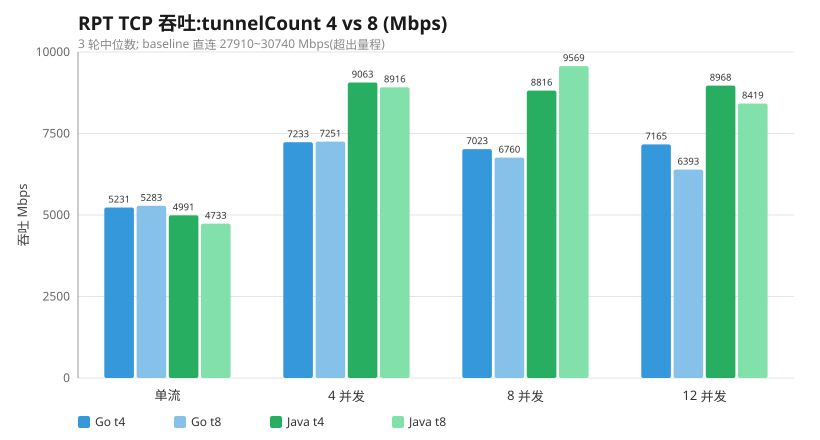
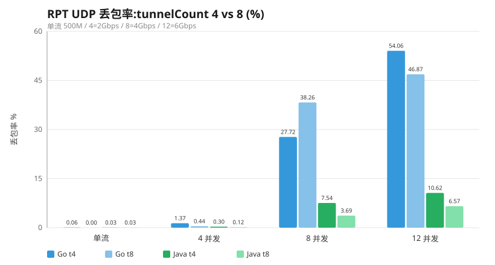
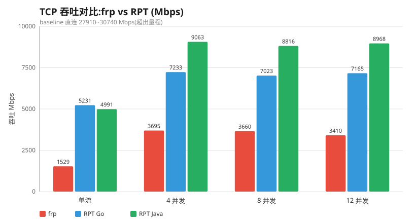
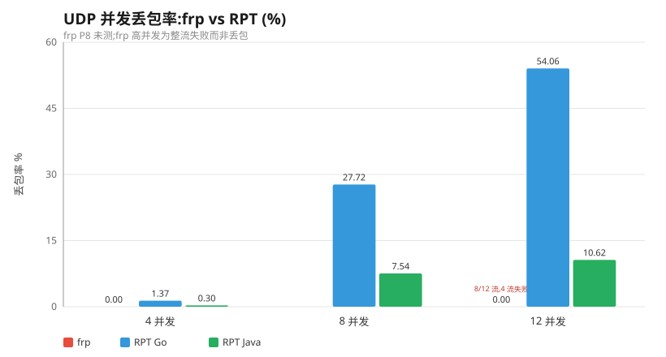
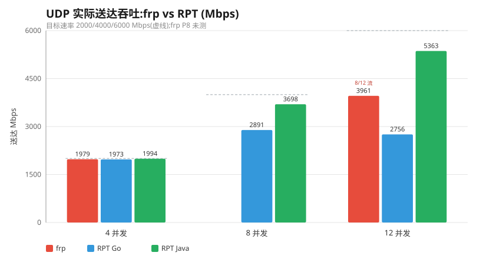

# RPT 压测报告(2026-09-30)

> Windows 11 专业版 · Intel Core i9-9980HK ×16 · iperf3 3.1.3 · 同机 loopback
> RPT v2.8.2 当前代码(默认 tunnelCount=4, socket 缓冲 8MB, 堆外 2GB)· frp v0.71.0 默认配置(token 认证, tcpMux 默认开)
> TCP 为 3 轮取中位数;UDP 单流多轮,UDP 并发单轮(N 个独立 iperf3 实例,每流独立端口)。

---

## 一、RPT 自身压测

### 1. TCP 吞吐:tunnelCount 4 vs 8(Mbps,3 轮中位数)

| 用例 | Go t4 | Go t8 | Java t4 | Java t8 |
| --- | --- | --- | --- | --- |
| 单流 | 5231 | 5283 | 4991 | 4733 |
| 4 并发 | 7233 | 7251 | 9063 | 8916 |
| 8 并发 | 7023 | 6760 | 8816 | 9569 |
| 12 并发 | 7165 | 6393 | 8968 | 8419 |

- **tunnelCount 4→8 对 TCP 吞吐无实质影响**,两端各档位波动均落在 ±11% 以内,属 loopback TCP 正常抖动。
- **客户端形态**:单流 Go(5231)> Java(4991);并发 Java(P4 9063 / P8 8816 / P12 8968)整体高于 Go(P4 7233 / P8 7023 / P12 7165)——Java TCP 并发扩展优于 Go。

### 2. UDP 丢包率:tunnelCount 4 vs 8(%)

| 用例 | Go t4 | Go t8 | Java t4 | Java t8 |
| --- | --- | --- | --- | --- |
| 单流 500M | 0.06 | 0.00 | 0.03 | 0.03 |
| 4 并发(2 Gbps) | 1.37 | 0.44 | 0.30 | 0.12 |
| 8 并发(4 Gbps) | 27.72 | 38.26 | 7.54 | 3.69 |
| 12 并发(6 Gbps) | 54.06 | 46.87 | 10.62 | 6.57 |

- **单流与 4 并发丢包已修复**(socket 缓冲 8MB 生效),baseline 全程 0%。
- **8/12 高并发**:Java 在 8 隧道下丢包进一步下降(P8 7.5%→3.7%,P12 10.6%→6.6%),符合「隧道数≈流数」规律;Go 噪声大、无稳定收益(P8 反而更差)。
- Go 高并发 UDP 丢包的主因是客户端单隧道写路径锁竞争 + 每数据报重序列化 Meta 的 CPU 开销,与 tunnelCount 无关。

### 3. 基线(直连,Mbps)

| 单流 | 4 并发 | 8 并发 | 12 并发 |
| --- | --- | --- | --- |
| 27910 | 30740 | 29645 | 27839 |

---

## 二、frp 对比

> 方法学与 RPT 完全一致:frps + frpc 替代 RPT server/client,相同端口拓扑、相同 iperf3 参数。

### 1. TCP 吞吐(Mbps)

| 用例 | baseline 直连 | frp 0.71.0 | RPT Go t4 | RPT Java t4 |
| --- | --- | --- | --- | --- |
| 单流 | 27910 | **1529** | 5231 | 4991 |
| 4 并发 | 30740 | **3695** | 7233 | 9063 |
| 8 并发 | 29645 | **3660** | 7023 | 8816 |
| 12 并发 | 27839 | **3410** | 7165 | 8968 |

- **单流 frp 只有 RPT Go 的 29%、RPT Java 的 31%**;相对直连,frp 损失 94.5%,RPT 损失约 81%。
- **并发方向相反**:frp 在 P4 见顶(~3.7 Gbps)后随并发**回落**;RPT 因 4 条 mTLS 隧道横向扩展,Java 单调升到 8.97 Gbps。
- 根因:frp 默认 tcpMux 把所有流压进单条 TCP 连接(yamux 单写者串行化),吞吐被单连接上限钉死;RPT 用 k 条独立 mTLS 隧道分摊。

### 2. UDP 单流 500M(丢包率)

| | frp | RPT Go | RPT Java |
| --- | --- | --- | --- |
| 首轮 | **0.00%** | 0.06% | 0.03% |
| 第 2/3 轮 | **超时(proxy 已关闭)** | 正常 | 正常 |

- frp 首轮无丢包,但 **UDP 代理是单会话**:一次会话结束 `bench-udp` 代理即关闭,同一端口无法再次复用,第 2、3 轮全部超时。RPT 的 UDP 中继无状态(按源地址逐数据报复用共享隧道),同端口可无限次复用。

### 3. UDP 并发(丢包率 / 存活流)

| 用例 | frp | RPT Go t4 | RPT Java t4 |
| --- | --- | --- | --- |
| 4 并发(2 Gbps) | **0.00%(4/4)** | 1.37%(4/4) | 0.30%(4/4) |
| 8 并发(4 Gbps) | 未测 | 27.72%(8/8) | 7.54%(8/8) |
| 12 并发(6 Gbps) | **0.00%(8/12,4 流失败)** | 54.06%(12/12) | 10.62%(12/12) |

- 低并发(P4)三者近似持平,均接近满速。
- 高并发下**失败模式不同**:frp 每端口一个单会话代理,超载时**整条流失败**(P12 只剩 8/12,存活流 0% 丢包,实际 3961 Mbps);RPT 共享隧道按数据报转发,超载时**流全存活但丢包**(Java P12 丢 10.6% 但 12/12 全通,实际 ~5363 Mbps)。

---

## 三、结论

| 维度 | frp 0.71.0 | RPT |
| --- | --- | --- |
| TCP 单流 | 1529 Mbps | Go 5231 / Java 4991(约 3.4×) |
| TCP 并发扩展 | 见顶回落(单 mux 瓶颈) | Java 随并发升(多隧道) |
| UDP 单流 | 0% 但**单会话,不可复用** | 0% 且可无限复用 |
| UDP 并发 | 独立代理隔离,超载整流失败 | 共享隧道,超载流存活但丢包 |

- **TCP**:RPT 单流快约 3.4×,并发扩展方向相反(RPT 升 / frp 回落)。
- **UDP**:frp 靠「每端口一个单会话代理」换低丢包,代价是端口不可复用、高并发下整流失败;RPT 是无状态共享中继,端口无限复用、所有流存活,高并发以丢包换吞吐。
- 二者定位不同:frp 面向 WAN 端口映射的易用性;RPT 面向高吞吐、高并发的隧道转发。

**RPT 优化建议**:默认 `tunnelCount` 提高到 8(高并发 UDP 丢包显著下降);Go 客户端高并发 UDP 丢包需专项优化(复用/缓存 Meta 序列化、排查隧道写路径锁竞争)。
