# RPT 多路复用（MUX）+ 通道级背压

## 1. 概述

### 1.1 背景

RPT 实现 **k 条逻辑通道复用在 n 条物理隧道上**（TunnelPool 轮询、STREAM_SET 反向索引、隧道级背压）。但原实现存在**队头阻塞**：一个慢通道的 `channelWritabilityChanged` 会 `tunnel.setAutoRead(false)` 停掉整条隧道，拖垮同隧道上的所有其他通道。

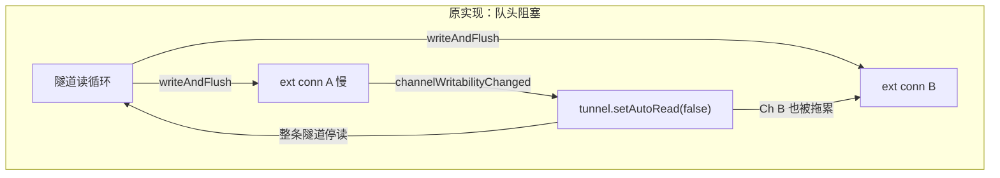

多个外部连接共享同一条隧道，各自独立控制 `tunnel.setAutoRead()`，还会**竞态**：A 慢设 false，B 快设 true，最后执行者覆盖前者。

### 1.2 目标

在不改变隧道复用架构的前提下，为每个通道配备**独立的带水位线缓冲区**，将流控粒度从"整条隧道"下沉到"单个会话"，并用 **PAUSE/RESUME 协议**实现双向背压。

### 1.3 架构总览

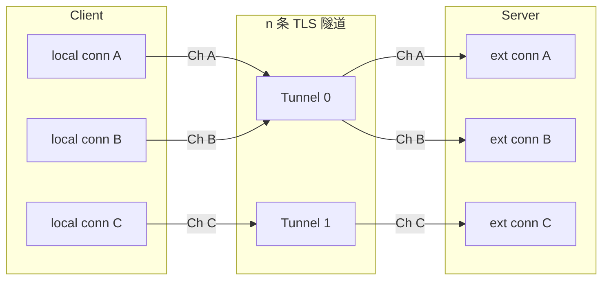

### 1.4 术语

| 术语 | 含义 |
|------|------|
| **控制通道** | Client↔Server 主 TLS 连接，负责注册、认证、心跳 |
| **隧道（Tunnel）** | 一条复用的 TLS 连接，承载多个通道的数据 |
| **通道（Channel）** | 一个代理会话，由 `channelId` 唯一标识 |
| **ChannelBuffer** | 每个通道的带水位线缓冲区，防队头阻塞 |
| **PAUSE / RESUME** | 通道级背压信号，双向，通知对端停止/恢复该通道的数据读取 |

---

## 2. 协议设计

### 2.1 消息类型

| Code | 类型 | 方向 | 含义 |
|------|------|------|------|
| 7 | TYPE_TUNNEL | Client→Server | 隧道注册（tunnel_new 已有） |
| **8** | **TYPE_PAUSE** | **双向** | 通道暂停：缓冲区达高水位 |
| **9** | **TYPE_RESUME** | **双向** | 通道恢复：缓冲区排空至低水位 |

### 2.2 消息格式

PAUSE/RESUME 复用现有 `Message` 格式，`Meta` 仅需 `channelId` + `serverId`：

```json
{ "channelId": "abc123", "serverId": "def456" }
```

### 2.3 隧道生命周期

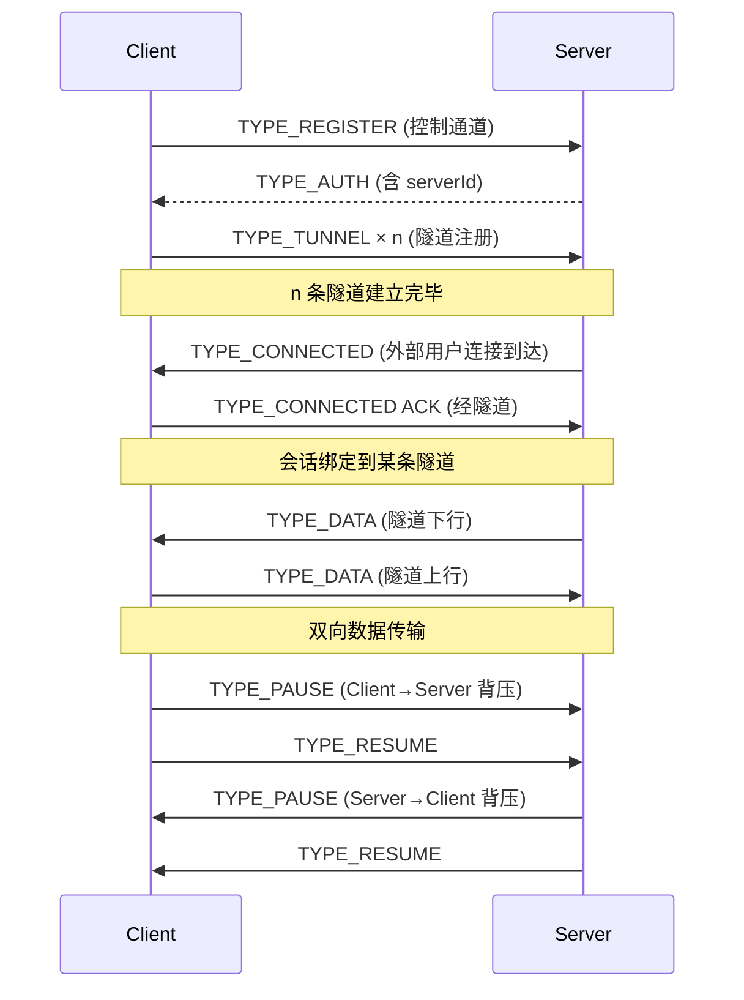

---

## 3. 背压设计

### 3.1 解决方案：per-channel 缓冲区

每个通道配备独立的 `ChannelBuffer`，隧道读循环将数据**投递到缓冲区**（非阻塞），由目标连接的可写性驱动**排空**。

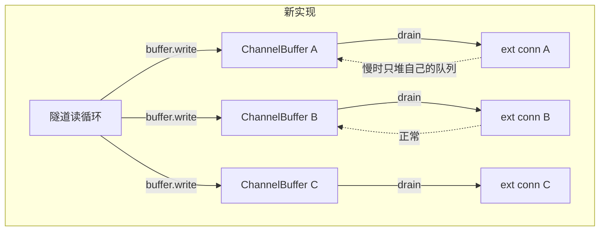

慢通道只堆积在自己的队列里，不影响其他通道。

### 3.2 水位线机制

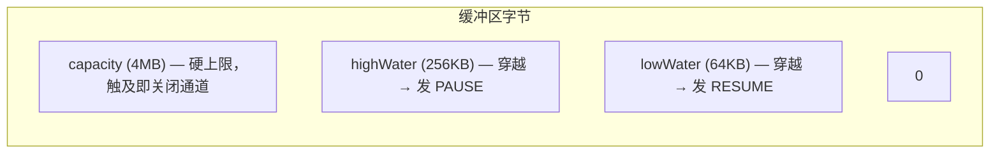

- **高水位穿越**：`bytes` 从 < highWater 升到 ≥ highWater 时，发 PAUSE，`paused=true`
- **低水位穿越**：`bytes` 从 > lowWater 降到 ≤ lowWater 且 `paused=true` 时，发 RESUME，`paused=false`
- **硬上限**：积压超过 capacity 说明对端没遵守背压，关闭该通道（不丢数据，因为 TCP 已 ACK）

### 3.3 双向背压

两个方向的流量各自独立背压，互不干扰：

**方向 A：Server→Client（外部用户→本地服务）**

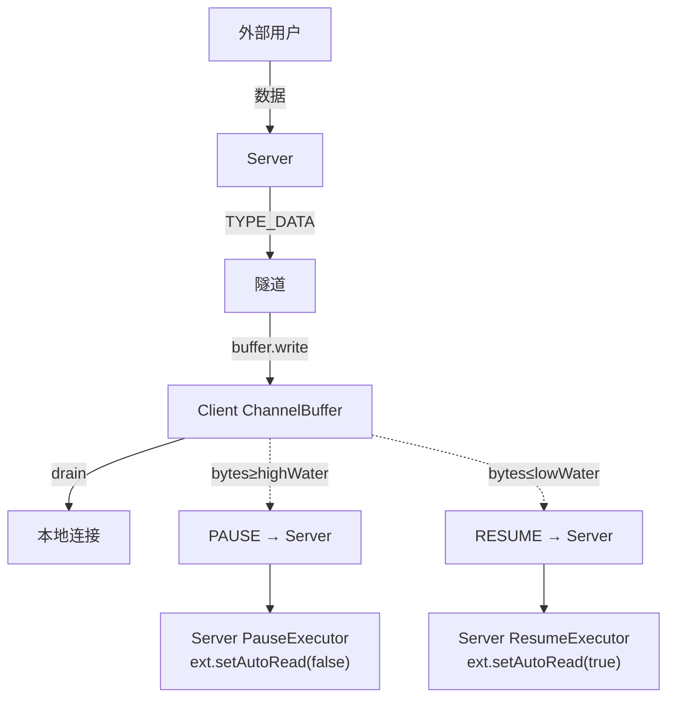

**方向 B：Client→Server（本地服务→外部用户）**

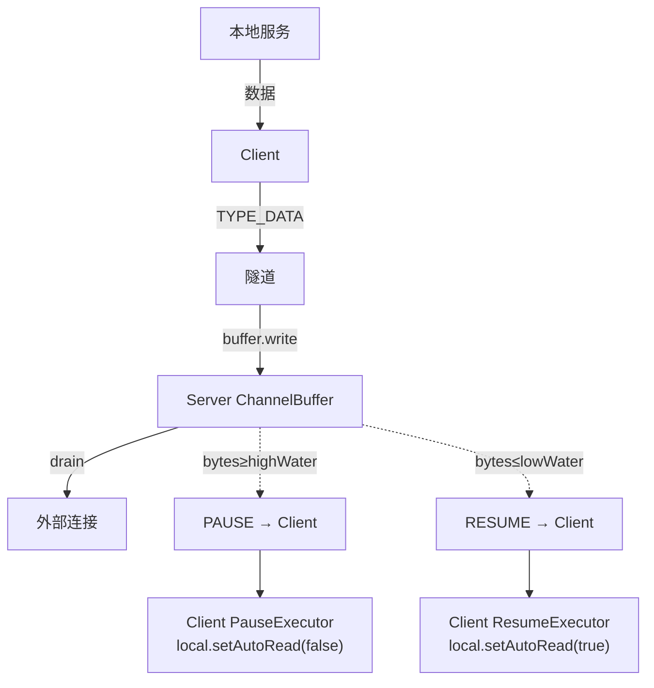

### 3.4 两层背压互不干扰

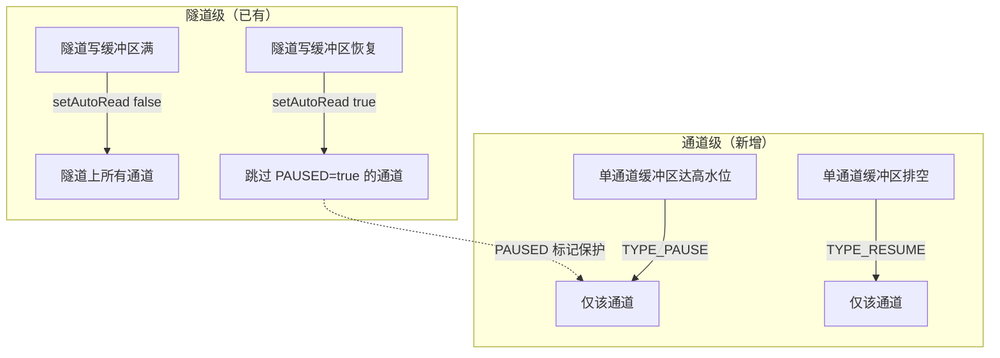

| 层级 | 触发条件 | 粒度 | 机制 |
|------|----------|------|------|
| **隧道级** | 隧道 TCP 写缓冲区满 | 所有通道 | `channelWritabilityChanged` → `setAutoRead` |
| **通道级** | 单通道缓冲区达高/低水位 | 单个通道 | `ChannelBuffer` → `onPause/onResume` 回调 → `TYPE_PAUSE/RESUME` |

---

## 4. 关键设计决策

### 4.1 线程模型

**Java 端**：所有 `ChannelBuffer` 状态只在目标连接的 eventLoop 上访问。`write()` 从隧道 eventLoop 调用时自动 hop 到 target eventLoop，因此用非线程安全的 `ArrayDeque` 即可，且天然保序。

**Go 端**：用 `sync.Mutex` + `sync.Cond` 实现阻塞队列，`TryPush` 非阻塞入队、`Pop` 阻塞取出，分属不同 goroutine。

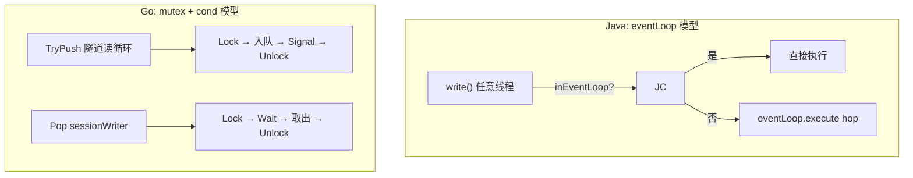

### 4.2 快路径

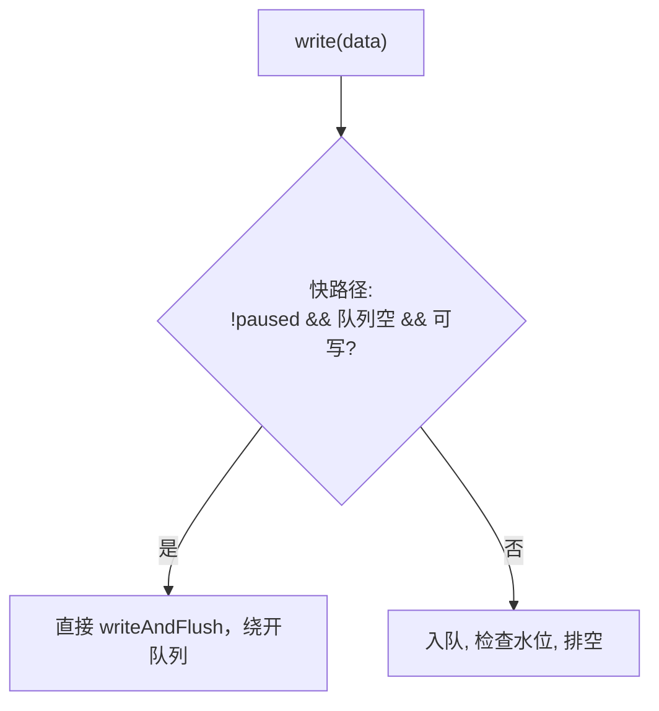

三个条件缺一不可：

| 条件 | 原因 |
|------|------|
| `!paused` | PAUSE 状态下必须走队列，否则 `doDrain` 不会被调用，RESUME 永远不会发出 |
| 队列空 | 有积压时直写会乱序（后到的数据抢先写出） |
| 可写 | 不可写时直写也只是堆到 Netty 内部缓冲，不如走队列统一管理水位 |

快路径避免单条大消息（如 HTTP 聚合后 8MB）入队后立即触发 PAUSE+RESUME 的浪费。

### 4.3 容量检查条件

积压超过 `capacity` 时关闭通道，但**只在队列已有积压时检查**：

- 队列空时单条消息无论多大都收下——消息不可拆分，关掉一条本来健康的连接是错误的
- 已有积压再超容量才关闭——说明对端确实没遵守背压

### 4.4 PAUSED 与 paused 分离

| 标记 | 管理者 | 作用 |
|------|--------|------|
| `PAUSED`（Channel Attribute） | 接收方（PauseExecutor 设，ResumeExecutor 清） | 隧道级恢复时跳过该通道，防止误覆盖 |
| `paused`（ChannelBuffer 私有字段） | 发送方（水位线穿越时设/清） | 保证一次 PAUSE 只对应一次 RESUME |

两者完全分离，不会出现一个方向的 RESUME 误清除另一个方向的 PAUSE。

### 4.5 ResumeExecutor 的隧道可写性检查

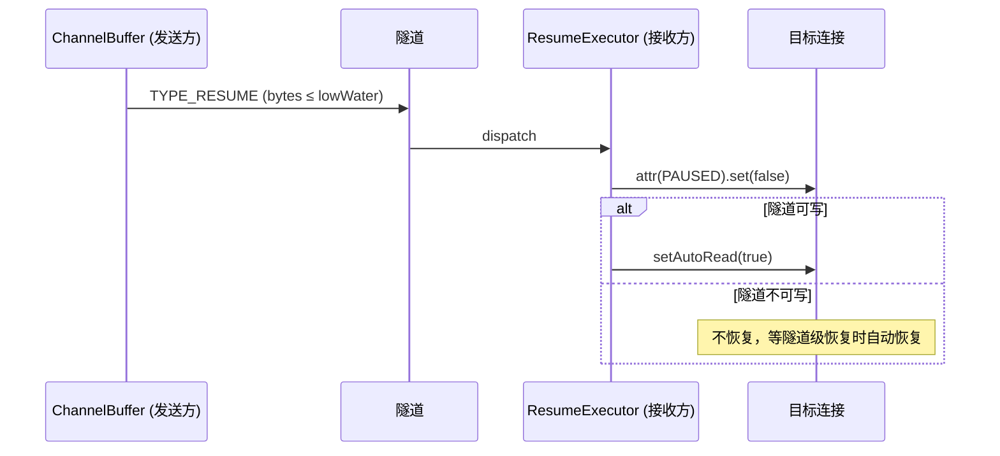

清除 PAUSED 标记后，只在隧道可写时才 `setAutoRead(true)`，防止顶掉隧道级暂停。隧道级恢复时因 PAUSED 已清除会正常恢复。

### 4.6 Go 暂停机制：SetReadDeadline + resumeCh

Go 没有 Netty 的 `setAutoRead`，需要手动打断阻塞 `Read`：

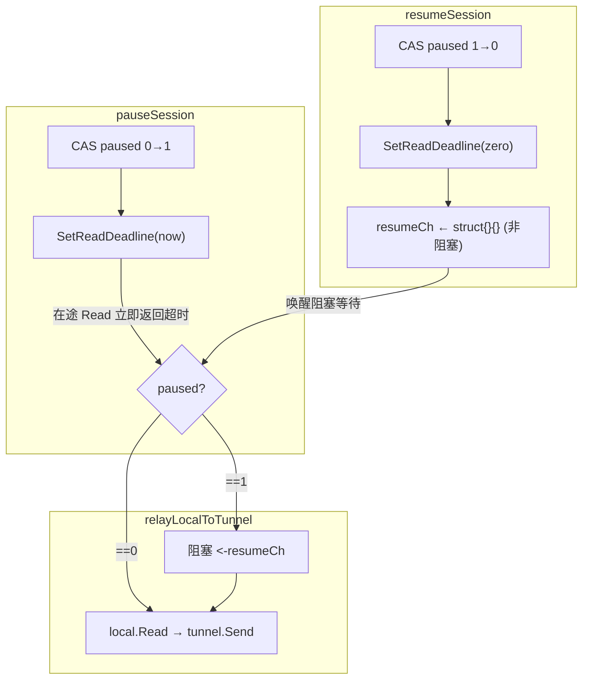

- **不轮询**：被暂停时阻塞在 `resumeCh`，不做 `time.Sleep` 轮询
- **CAS 保证幂等**：重复 PAUSE/RESUME 只生效一次
- **Read 超时不是错误**：超时后回到暂停检查点，已读到的字节已发出

### 4.7 Go PAUSE/RESUME 的天然延迟

Go 的 `TryPush`（隧道读循环）和 `Pop`（sessionWriter goroutine）分属不同 goroutine。PAUSE 在 `TryPush` 中触发，RESUME 在 `Pop` 中触发，两者之间有 writer goroutine 消费数据的天然延迟，不会出现同一调用内 PAUSE+RESUME 震荡。

### 4.8 UDP 不参与背压

UDP 数据报直写不排队，PauseExecutor/ResumeExecutor 排除 UDP 通道。UDP 是无连接协议，排队和背压没有意义。

---

## 5. 配置参考

```yaml
# client.yml / server.yml（可选，以下为默认值）
tunnelCount: 4         # 隧道数量（仅客户端），默认 4
highWater: 262144       # 高水位（字节），默认 256KB
lowWater: 65536         # 低水位（字节），默认 64KB
capacity: 4194304       # 硬上限（字节），默认 4MB
```

| 参数 | 默认值 | 说明 |
|------|--------|------|
| `tunnelCount` | 4 | 共享数据隧道数量（仅客户端） |
| `highWater` | 256KB | 单通道积压达到此值时发 PAUSE |
| `lowWater` | 64KB | 单通道积压排空到此值时发 RESUME |
| `capacity` | 4MB | 硬上限，触及即关闭该通道 |

---

## 6. 后续优化方向

1. **信用制流控**：PAUSE/RESUME 升级为类似 WINDOW_UPDATE 的信用制，减少 RTT 开销
2. **自适应水位线**：根据 RTT 和带宽动态调整高/低水位
3. **通道优先级**：高优先级通道在隧道写满时优先发送
